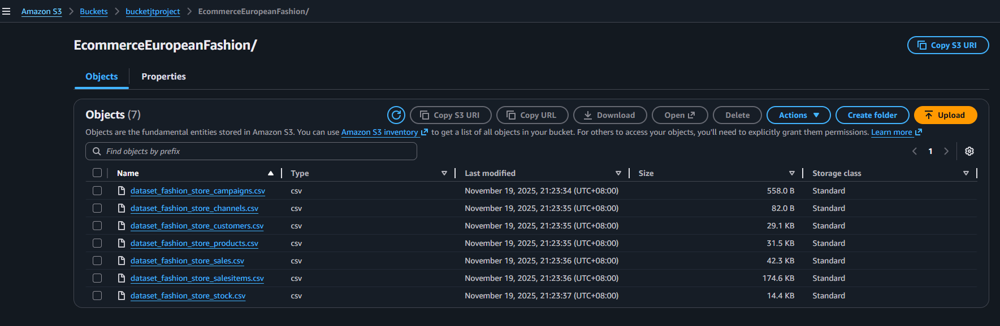
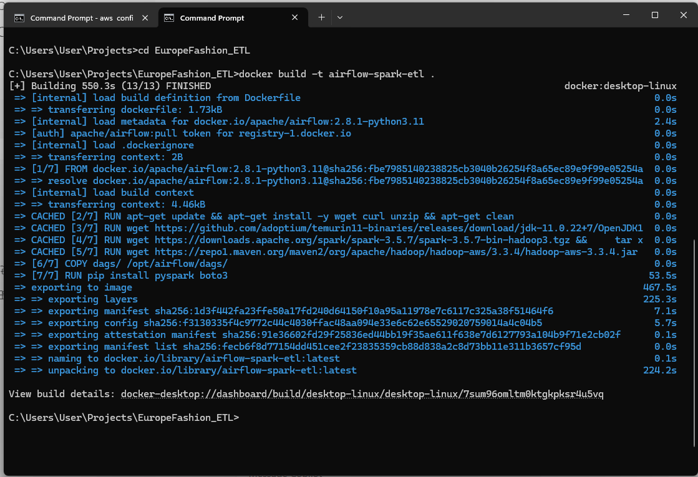
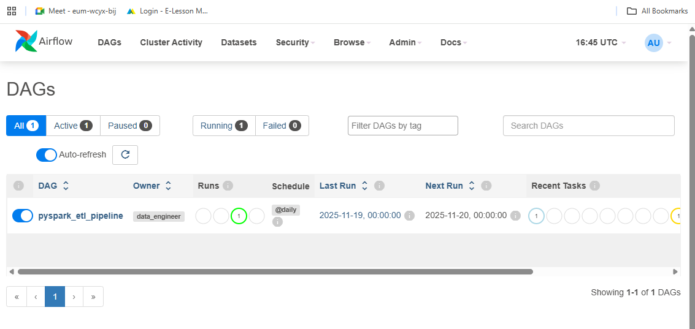
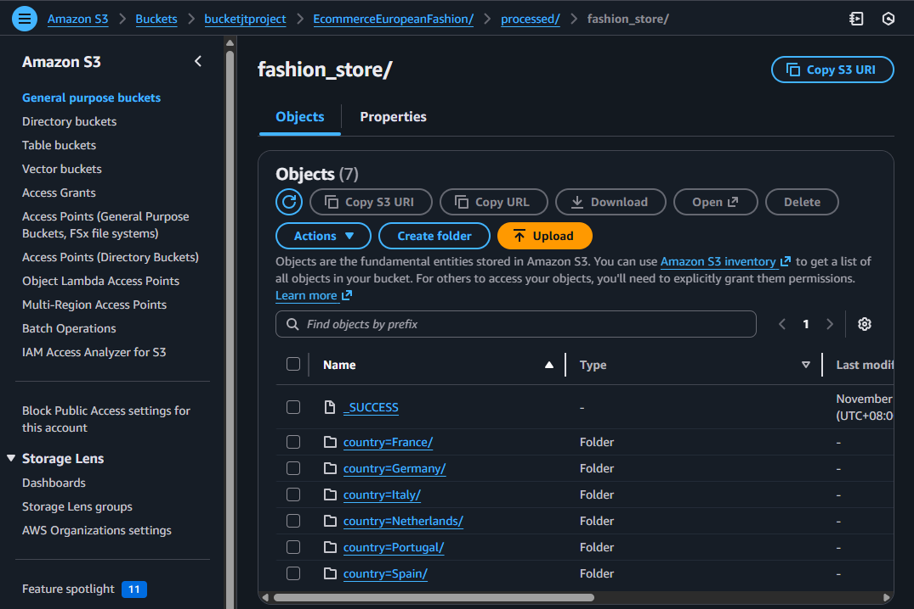
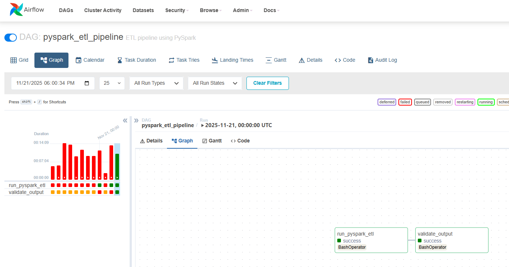

## curly-robot
### README: PySpark ETL Pipeline with Airflow & Docker
#### Project Overview
This project demonstrates an end-to-end ETL pipeline using PySpark, orchestrated with Apache Airflow, and containerized with Docker. It processes multi-table retail data, performs transformations, and writes results to Parquet (or S3).

#### Architecture
[Data Source: Kaggle CSVs] → [PySpark ETL] → [Airflow DAG] → [Parquet/S3]

#### Prerequisites

- Docker Desktop (with WSL2 backend enabled)
- Git
- AWS credentials for using S3
- Kaggle dataset: https://www.kaggle.com/datasets/joycemara/european-fashion-store-multitable-dataset

#### Project Structure

project-root/
 ├── Dockerfile
  ├── docker-compose.yml
  ├── dags/
  │    ├── pyspark_etl_dag.py
  │    └── scripts/
  │         ├── pyspark_etl.py
  │         └── validate.py
  ├── requirements.txt
  └── README.md

### Setup Instructions
- 1. Clone the Repository
git clone [https://github.com/jeannieteo/curly-robot](https://github.com/jeannieteo/curly-robot)
cd curly-robot

- 2. Place Your Data
Download the Kaggle dataset and put CSV files in data/ or upload to S3.
AWS S3 buckets contains the csv files: (You have to create your own s3 in AWS.)

- 3. Generate a Fernet Key: Airflow requires a Fernet key for encrypting sensitive data.
      Generate one using Python:
 `from cryptography.fernet import Fernet`
 `print(Fernet.generate_key().decode())`
	 Replace YOUR_FERNET_KEY in the docker-compose.yml file with the generated key.

- 4. Build Your Custom Image: files: Dockerfile, docker-compose.yml
 `docker build -t airflow-spark-etl .`
 `docker-compose build`

- 5. Initialize the Database: Run the following command to initialize the Airflow database:

`docker-compose run airflow airflow db init`
 

- 6. Start Services
`docker-compose up -d`

- 7. Add admin user for login into Airflow UI
`docker-compose run airflow airflow users create --username admin --firstname Admin --lastname User --role Admin --email admin@example.com --password admin`

- 8. Access Airflow UI
Go to: http://localhost:8080
Default credentials: admin / admin

- 9. Trigger DAG
Enable and trigger pyspark_etl_dag in Airflow UI.

#### Airflow DAG Overview
 Task 1: Run PySpark ETL (spark-submit inside container).
The partition files are set to be placed in s3 buckets in processed/fashion_store folder:
 

 Task 2: Validate output using validate.py.

#### Environment Variables
 Set AWS credentials in .env or Docker Compose:
 AWS_ACCESS_KEY_ID=your_key
 AWS_SECRET_ACCESS_KEY=your_secret
 AWS_DEFAULT_REGION=your_region

#### Tech Stack
 Apache Airflow for orchestration
 PySpark for ETL
 Docker & Docker Compose for containerization
 Postgres for Airflow metadata
 AWS S3 (optional) for storage

-----------------------------------------

Local execution on windows always breaks on the wintils parts so I used docker

spark-submit  --master local[*] --packages org.apache.hadoop:hadoop-aws:3.4.1   --conf spark.hadoop.fs.s3a.access.key=<AWS_KEY_ID> --conf spark.hadoop.fs.s3a.secret.key=<AWS_SECRET_KEY> --conf spark.hadoop.fs.s3a.endpoint=s3.amazonaws.com   pyspark_etl.py
